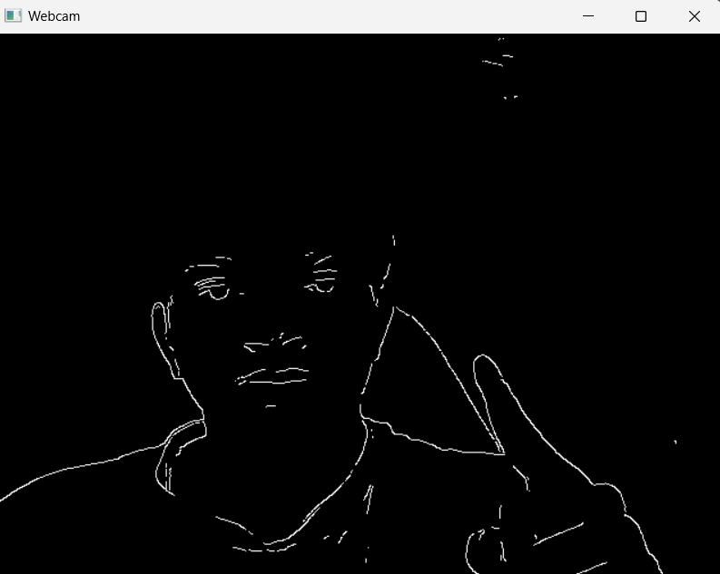

# Real-Time Webcam Edge Detection using OpenCV

This project demonstrates real-time edge detection using OpenCV and a webcam. It captures live video feed from your webcam, applies the Canny edge detection algorithm, and displays the processed video in real-time.

## Features
- **Edge Detection:** Real-time edge detection using OpenCV's `Canny` method.
- **Webcam Integration:** Captures live video from your webcam.
- **Adjustable Thresholds:** Modify the thresholds in the code to tune edge detection.



## How to Use
1. Clone this repository:
    ```bash
    git clone https://github.com/yourusername/webcam-edge-detection.git
    ```

2. Install the required dependencies:
    ```bash
    pip install -r requirements.txt
    ```

3. Run the application:
    ```bash
    python main.py
    ```

4. To stop the application, press `q`.

## Project Dependencies
- Python 3.9+
- [OpenCV](https://opencv.org/)